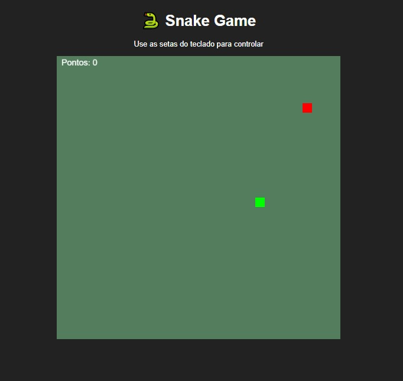
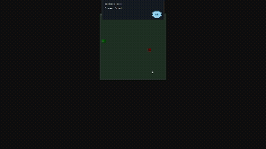

# 🎮 Projeto Plataforma 2D — Godot Engine

## 📝 Descrição do Projeto

Esse é um projeto básico para testar mecânicas do JavaScript e consecutivamente aprender a usar o WebStorm IDEA, com eles eu fiz um jogo clássico SnakeGame 2D sem muitos detalhes, apenas formas e cores com textos simples em uma página Web. Esse jogo não tem objetivo de ser melhorado é apenas para testes e conhecimentos para aprender mais sobre javaScript

---

## 🕹️ Objetivos

- Aprender JavaScript.
- Praticar criação de jogos com foco em plataformas 2D.
- Aprender sistemas de colisões, controles, físicas, mecânicas e sprites.
- Estudar sobre o WebStorm IDEA e Node.js.

---

## 📸 Imagens do Jogo

 
---

---

## 🚧 Status do Projeto

🔧 Completo, apenas para testes e conhecimento sobre JavaScript.

---

